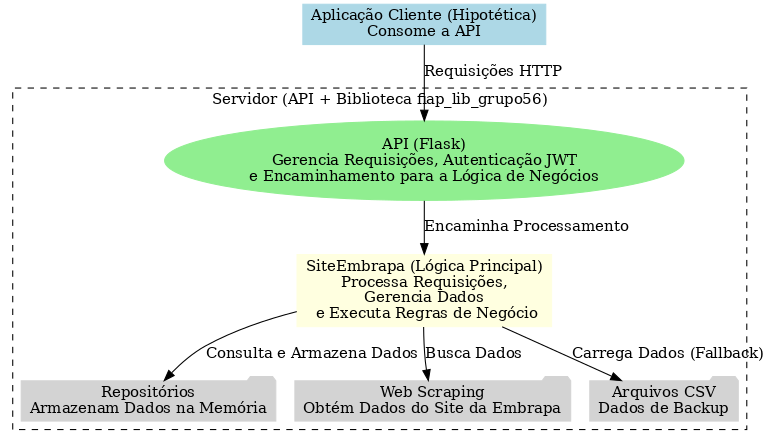

# API Tech Challenge - Grupo 56 (4MLET)

Este repositório contém a implementação de uma API desenvolvida em Python utilizando o framework Flask. A API foi criada como parte de um trabalho acadêmico do curso de pós-graduação em Machine Learning Engineering, da FIAP - 4MLET

A API é capaz de acessar, processar e fornecer dados relacionados à produção, processamento, comercialização, importação e exportação de produtos vitivinícolas no Brasil. Esses dados são obtidos a partir do site da **Embrapa** via **web scraping**, com suporte a arquivos **CSV** como fallback.

Site utilizado: http://vitibrasil.cnpuv.embrapa.br/

## Estrutura do Projeto



### Camada Cliente
A API é projetada para ser consumida por uma aplicação cliente, que pode fazer requisições HTTP para as rotas expostas.

### Camada Servidora
A lógica do servidor está organizada em:
- **API**: Gerencia o roteamento, autenticação via JWT e a interface com o cliente.
- [**Biblioteca fiap_lib_grupo56**](biblioteca/fiap_lib_grupo56 "Detalhamento da biblioteca"): Contém classes para orquestração da lógica de negócio e manipulação de dados, incluindo:
  - **Classe SiteEmbrapa**: Centraliza a lógica de negócios e orquestra o acesso a dados.
  - **Repositórios**: Mantêm os dados carregados em memória.  Obtém os dados a partir de:
     - **Web Scraping**: Obtém informações diretamente do site da Embrapa.
     - **CSV**: Carrega dados de backup em caso de indisponibilidade do site.
- **Swagger**: Documentação da API.  Permite realizar chamadas para teste da aplicação servidora.     

## Funcionalidades da API

### Funcionamento padrão
A aplicação servidora inicia sem nenhum dado carregado em memória. À medida que os endpoints relacionados à Produção, Processamento, Comercialização, Importação e Exportação são acessados pela aplicação cliente, a API realiza o web scraping no site da Embrapa, obtendo os dados específicos solicitados. Os dados obtidos são armazenados em memória, permitindo que futuras solicitações sejam atendidas de forma mais rápida, sem a necessidade de novas consultas ao site da Embrapa. Entretanto, caso a aplicação seja reiniciada, a memória é limpa, e as informações voltarão a ser buscadas diretamente no site da Embrapa.

Como alternativa ao web scraping, a API conta com um conjunto de arquivos .CSV disponibilizados pela Embrapa, contendo todos os dados utilizados para alimentar o site oficial. Esses arquivos foram baixados e são mantidos na aplicação para garantir o funcionamento da API em cenários onde o site da Embrapa esteja offline ou instável. Nessas situações, a API utiliza os dados dos arquivos CSV para responder às requisições.

Além disso, existe um endpoint especial na API: /vitibrasil/carrega_csv. Quando chamado, ele carrega todos os dados contidos nos arquivos CSV diretamente na memória da aplicação. Após essa operação, todas as requisições subsequentes utilizarão os dados previamente carregados dos arquivos CSV, em vez de realizar consultas ao site da Embrapa (web scraping).

Também é possível limpar o cache da API: /vitibrasil/limpa_cache.  Com o cache limpo, as futuras consultas voltarão a realizar o web scrapping no site da Embrapa.

### link da publicação no Vercel - em "produção"

- Acesse pelo link: https://fiap-4mlet-grupo56.vercel.app/ 

### Endpoints
1. **Autenticação**
   - Gera um token JWT para autenticação das demais chamadas.  Todas as chamadas necessitam do token JWT.

2. **Configuração**
   - Rota: `/vitibrasil/carrega_csv`
      - Carregar os dados de arquivos .CSV locais à aplicação servidora e os coloca em cache para atender às requisições posteriores por dados.  A partir desta chamada, a API não tentará buscar os dados diretamente no site da Embrapa.
   - Rota `/vitibrasil/limpa_cache`
      - Esvazia o cache de dados.  Tanto dados de consultas anteriores, que ficam em cache, como os dados possivelmente carregados dos arquivos .CSV serão limpos do cache.  A partir desta chamada, a API voltará a buscar os dados diretamente no site da Embrapa.  Novo cache começa a ser montado com as novas consultas de dados.

3. **Produção**, **Processamento**, **Comercialização**, **Importação** e **Exportação**
   - Consultar o [swagger](https://fiap-4mlet-grupo56.vercel.app/swagger) da API para detalhes dos endpoints

### Documentação com Swagger
A API inclui uma interface de documentação interativa gerada pelo Swagger, biblioteca Flasgger do python.
https://fiap-4mlet-grupo56.vercel.app/swagger

## Requisitos

- Python 3.12

### Dependências
As principais dependências incluem:
- Flask - API
- Flask-JWT-Extended - JWT
- Flasgger - Swagger
- bs4 (BeautifulSoup) - web scraping
- fiap_lib_grupo56

### Para compilar

## API
- Abrir o visual code na pasta /api_grupo56
- atualizar os pacotes (pip install -r requirements.txt)

## biblioteca fiap_lib_grupo56
- Abrir o visual code na pasta /biblioteca/fiap_lib_grupo56
- atualizar os pacotes (pip install -r requirements.txt)

## Estrutura de Arquivos

```
(fiap_4MLET_grupo56)                    # pasta raiz do repositório no github
├── api_grupo56/                        # PASTA RAIZ DO PROJETO DA API. (abrir esta pasta no VS)
│   ├── .venv                           # python
│   ├── app.py                          # Código principal da API
│   └── requirements.txt                # Dependências do projeto
├── biblioteca/                    
│   └── fiap_lib_grupo56/               # PASTA RAIZ DO PROJETO DA BIBLIOTECA (https://pypi.org/project/fiap-lib-grupo56/). (abrir esta pasta no VS)
│       ├── .venv                       # python da biblioteca
│       ├── src                         # 
│       │   ├── modelo_dados/               # Classes para tratamento de dados
│       │   │   ├── __init__.py             # Arquivo de inicialização do pacote
│       │   │   ├── comercializacao.py      # classes de dados e repositório
│       │   │   ├── importacaoExportacao.py # classes de dados e repositório
│       │   │   ├── processamento.py        # classes de dados e repositório
│       │   │   └── produção.py             # classes de dados e repositório
│       │   └── site_embrapa/           
│       │       ├── __init__.py             # Arquivo de inicialização do pacote
│       │       ├── site_embrapa.py         # Classe central da lógica do servidor
│       │       └── arquivos_csv/           # Arquivos CSV com dados de backup
│       │           └── ...(*.CSV)          # Arquivos CSV para fallback
│       ├── anotacoes.txt               # Orientações de como publicar fiap_lib_grupo56 no pypi.org
│       ├── MANIFEST.in                 # Manifesto para inclusão dos arquivos .CSV no pacote
│       ├── LICENSE                     
│       ├── setup.py                    # Configuração do fiap_lib_grupo56 para o pypi.org
│       └── requirements.txt            # Dependências do projeto
│   
├── Diagrama_TechChallenge_grupo56.png  # Diagrama de estrutura e macro funcionamento da API
└── README.md                           # Descrição do projeto no github.  Este arquivo.
```

## Observações

- **Segurança**: Certifique-se de alterar a chave secreta de autenticação (`JWT_SECRET_KEY`) antes de usar em produção (app.py de api_grupo56)
- **Teste**: Use as credenciais `username: 4MLET` e `password: 4MLET` para autenticação nos testes. (usar /login no swagger para gerar o token JWT)

## Autor
- **Nome**: Fábio Vargas Matos - Grupo 56 - 4MLET
- **Contato**: [fabiomatos@baneses.com.br](mailto:fabiomatos@baneses.com.br)

## Licença
Este projeto é distribuído sob a licença MIT. Consulte o arquivo `LICENSE` para mais detalhes.
