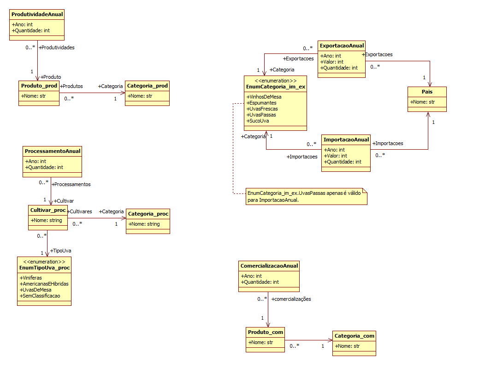

# API Tech Challenge - Grupo 56 (4MLET) - Biblioteca fiap_lib_grupo56

Este repositório contém a implementação de uma API desenvolvida em Python utilizando o framework Flask. A API foi criada como parte de um trabalho acadêmico do curso de pós-graduação em Machine Learning Engineering, da FIAP.

A API é capaz de acessar, processar e fornecer dados relacionados à produção, processamento, comercialização, importação e exportação de produtos vitivinícolas no Brasil. Esses dados são obtidos a partir do site da **Embrapa** via **web scraping**, com suporte a arquivos **CSV** como fallback.

Site utilizado: http://vitibrasil.cnpuv.embrapa.br/

## Biblioteca fiap_lib_grupo56

### link do módulo criado e publicado no pypi.org

https://pypi.org/project/fiap-lib-grupo56/

```bash
   pip install fiap_lib_grupo56
```

### Biblioteca autônoma, para atender às demandas da API

A **fiap_lib_grupo56** foi desenvolvida para ser autônoma na terafa de obter, tratar, fazer cache e realizar consultas elaboradas acerca dos dados expostos no site da Embrapa - http://vitibrasil.cnpuv.embrapa.br/

Desta forma, apesar de não ser o objetivo para qual foi desenvolvida, a biblioteca pode ser utilizada para se obter os dados do site da Embrapa, de forma independente do uso da API.  A **classe SiteEmbrapa** é a porta de entrada da **fiap_lib_grupo56** e dá acesso a uma gama de métodos de consulta às informações da Embrapa.  Tudo encapsulado na biblioteca, inclusive os arquivos .CSV para fallback.  Até mesmo com o site da Embrapa fora do ar, a biblioteca responderá com as informações dos arquivos .CSV.

# Exemplo de uso independente da API:

requirements.txt
```bash
requests==2.32.3
bs4==4-0.0.2
fiap_lib_grupo56
```


```bash
pip install -r requirements.txt
```

teste.ipynb
```bash

import locale
from site_embrapa import SiteEmbrapa
from modelo_dados.processamento import EnumTipoUva_proc, ProcessamentoAnual
from modelo_dados.importacaoExportacao import EnumCategoria_im_ex

locale.setlocale(locale.LC_ALL, 'pt_BR.UTF-8')
site_embrapa = SiteEmbrapa()

ano = 2017
processamentos = site_embrapa.obterProcessamentoPorAnoTipoUva(ano, EnumTipoUva_proc.UVASDEMESA)
print(f"==== Processamento de cultivares de uva de mesa no ano de {ano} ====")
for proc in processamentos:
    print(f"{proc.ano} - {proc.cultivar.nome} - {proc.cultivar.categoria.nome} - {proc.quantidade:n}")

ano = 1973
print("")
print(f"==== Importações de suco de uva no ano de {ano} ====")
importacoes = site_embrapa.obterImportacaoPorAnoCategoria(ano, EnumCategoria_im_ex.SUCODEUVA)
for imp in importacoes:
    if imp.valor > 0 or imp.quantidade > 0:
        print(f"{imp.ano} - {imp.categoria.value} - {imp.pais.nome} - {imp.quantidade:n}- R${imp.valor:n}")

```


### Componentes
A lógica do servidor está organizada em:
- **Classe SiteEmbrapa**: Centraliza a lógica de negócios e orquestra o acesso a dados.
- **Repositórios**: Mantêm os dados carregados em memória, obtidos a partir de:
     - **Web Scraping**: Obtém informações diretamente do site da Embrapa.
     - **CSV**: Carrega dados de backup em caso de indisponibilidade do site.
- **Classes de dados**: Com os dados obtidos do site, mantidos estruturados em memória.
     - **Produtos**, **Categorias**, **Produções**, **Processamento**, **Importação** 



## Funcionalidades da API

### Funcionamento padrão
Todas as chamadas recebidas pela API serão repassadas para a classe SiteEmbrapa.

A camada da API, fora da biblioteca, trata das questões de segurança, exigência de parâmetros nas chamadas, swagger etc...

A camada da biblioteca trata da obtenção, tratamento e fornecimento dos dados.

As informações relacionadas à Produção, Processamento, Comercialização, Importação e Exportação são obtidos ou através do web scrapping ou através do fallback nos arquivos .CSV, previamente baixados e empacotados dentro da biblioteca.

A classe SiteEmbrapa se utiliza de outras classes de apoio internas à biblioteca para gerir a obtenção dos dados de forma otimizada e disponibilizá-los de forma organizada e estruturada.

## Requisitos

- Python 3.12

### Dependências
As principais dependências incluem:
- bs4 (BeautifulSoup)
- setuptools
- wheel
- twine

### Preparação de uma versão da biblioteca

1. Atualizar a versão no setup.py, pois o PyPi.org não aceita repetições de numero de versão (version='0.3.3',):
   ```bash
   from setuptools import setup, find_packages

   setup(
      name='fiap_lib_grupo56',
      version='0.3.2',
      packages=find_packages(),
      description='Biblioteca para o trabalho Tech Challenge do grupo 56 da 4MLET',
      author='Fabio Vargas Matos',
      author_email='fabiomatos@baneses.com.br',
      url='https://github.com/fabiomatos71/fiap_4MLET_grupo56',
      install_requires=[],
      include_package_data=True,  # Inclui arquivos listados no MANIFEST.in
      package_data={
         # Especifica arquivos dentro de `fiap_lib_grupo56/arquivos_csv/`
         "fiap_lib_grupo56": ["site_embrapa/arquivos_csv/*.csv"],
      },
      classifiers=[
         'Programming Language :: Python :: 3',
         'License :: OSI Approved :: MIT License',
         'Operating System :: OS Independent',
      ],
      python_requires='>=3.12.0',
   )   
   ```

2. gerar o dist da aplicação "biblioteca":
   ```bash
   python setup.py sdist bdist_wheel
   ```

3. Para subir para o Pypi:
   ```bash
   twine upload dist/*
   ```

## Estrutura de Arquivos

```
(fiap_4MLET_grupo56)                    # pasta raiz do repositório no github
├── api_grupo56/                        # PASTA RAIZ DO PROJETO DA API. (abrir esta pasta no VS)
│   ├── .venv                           # python
│   ├── ...                             
│   └── requirements.txt                # Dependências do projeto
├── biblioteca/                    
│   ├── fiap_lib_grupo56/               # PASTA RAIZ DO PROJETO DA BIBLIOTECA (https://pypi.org/project/fiap-lib-grupo56/). (abrir esta pasta no VS)
│   │   ├── .venv                       # python da biblioteca
│   │   ├── modelo_dados/               # Classes para tratamento de dados
│   │   │   ├── __init__.py             # Arquivo de inicialização do pacote
│   │   │   ├── comercializacao.py      # classes de dados e repositório
│   │   │   ├── importacaoExportacao.py # classes de dados e repositório
│   │   │   ├── processamento.py        # classes de dados e repositório
│   │   │   └── produção.py             # classes de dados e repositório
│   │   ├── site_embrapa/           
│   │   │   ├── __init__.py             # Arquivo de inicialização do pacote
│   │   │   ├── site_embrapa.py         # Classe central da lógica do servidor
│   │   │   └── arquivos_csv/           # Arquivos CSV com dados de backup
│   │   │       └── ...(*.CSV)          # Arquivos CSV para fallback
│   │   ├── anotacoes.txt               # Orientações de como publicar fiap_lib_grupo56 no pypi.org
│   │   ├── MANIFEST.in                 # Manifesto para inclusão dos arquivos .CSV no pacote
│   │   ├── LICENSE                     
│   │   ├── setup.py                    # Configuração do fiap_lib_grupo56 para o pypi.org
│   │   └── requirements.txt            # Dependências do projeto
│   └── ...
├── Diagrama_TechChallenge_grupo56.png  # Diagrama de estrutura e macro funcionamento da API
└── README.md                           # Descrição do projeto no github.  Este arquivo.
```

## Autor
- **Nome**: Fábio Vargas Matos - Grupo 56 - 4MLET
- **Contato**: [fabiomatos@baneses.com.br](mailto:fabiomatos@baneses.com.br)

## Licença
Este projeto é distribuído sob a licença MIT. Consulte o arquivo `LICENSE` para mais detalhes.
